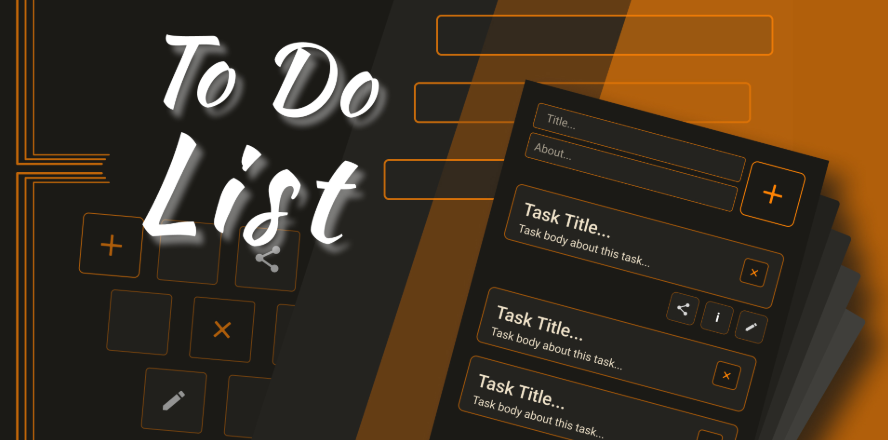
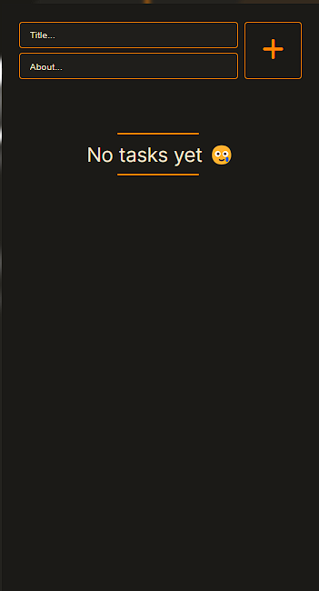
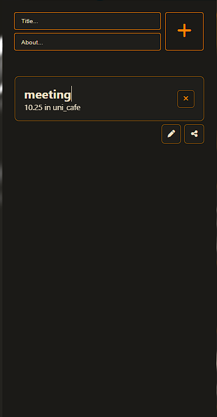

# 📝 ToDoApp.1

A simple, clean, and responsive ToDo list app built using vanilla JavaScript. This project was created to practice DOM manipulation, event handling, and using `localStorage` to persist data without a backend.

---

## Key Features

- Add, edit, and delete tasks easily  
- Mark tasks as completed or uncompleted  
- Tasks are saved automatically using `localStorage`  
- Fully responsive layout (mobile and desktop)  
- Built with pure HTML, CSS, and JavaScript — no frameworks  

---

## About the Code

This project focuses on core JavaScript functionality without relying on any frameworks or libraries. Some of the key implementation points:

- **Event Delegation**: Used for better performance when handling click events on dynamic task items.  
- **Local Storage**: All tasks are stored in the browser using `localStorage`, so they remain even after the page is refreshed.  
- **DOM Manipulation**: Tasks are rendered dynamically, and all user interactions update both the UI and storage in real-time.  
- **Separation of Concerns**: UI rendering, data storage, and event logic are kept modular and organized for future improvements.  

Code is commented and structured to be beginner-friendly and ready for scaling up later.

---

## Screenshots

  
> Basic view with tasks listed. Tasks can be marked complete or edited.

  
  
> Form to add a new task with validation.

---

## Getting Started

1. Clone the repo:
   ```bash
   git clone https://github.com/moulahguine/todoApp.1.git
   ```

2. Open the project folder:
   ```bash
   cd todoApp.1
   ```

3. Open `index.html` in your browser, or use a live server if you're using VS Code.

---

## Planned Improvements

- Add categories or tags for tasks  
- Due dates and reminders  
- Better accessibility (keyboard navigation, screen reader support)  
- Dark mode  
- Drag-and-drop task ordering  
- Option to sync tasks via a backend in the future  

---

## About Me

Hi, I'm Mohamed Oulahguine — a frontend developer passionate about building clean UIs and improving my JavaScript skills. This project is part of my learning journey, and I'll keep adding more features over time.

Feel free to reach out or contribute!

- Email: [mohamedoulahguine@gmail.com](mailto:mohamedoulahguine@gmail.com)  
- GitHub: [moulahguine](https://github.com/moulahguine)

